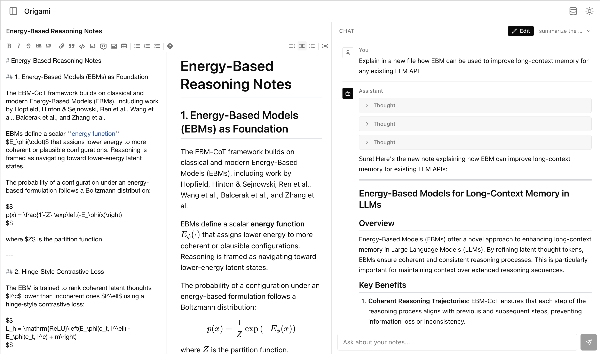
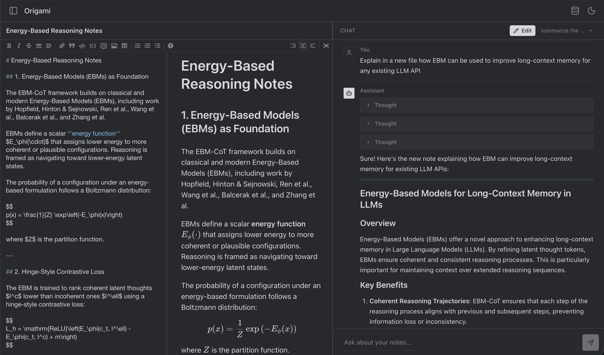

# Origami

Local AI research assistant. Upload PDFs, take Markdown notes, and chat with an LLM that has context over your documents and notes.

**Stack:** FastAPI + LangGraph + ChromaDB + Ollama (backend) | Next.js 16 + React 19 + AI SDK v6 (frontend)

## Prerequisites

- [Ollama](https://ollama.com/) installed and running
- [Bun](https://bun.sh/) (v1.3+)
- [Python](https://www.python.org/) 3.13+
- [uv](https://docs.astral.sh/uv/) (Python package manager)

## Gallery

Themes:





## Setup

### 1. Ollama

Install Ollama and pull the model:

```bash
# macOS
brew install ollama

# Start the Ollama server (runs on port 11434)
ollama serve

# In a separate terminal, pull the default model
ollama pull deepseek-r1:7b
```

Make sure `ollama serve` is running before starting the backend.

### 2. Backend

```bash
cd backend

# Create virtual environment and install dependencies
uv sync

# Start the FastAPI server (runs on port 8000)
uv run uvicorn main:app --reload
```

### 3. Frontend

```bash
cd frontend

# Install dependencies
bun install

# Start the dev server (runs on port 3000)
bun run dev
```

### 4. Open the app

Visit [http://localhost:3000](http://localhost:3000).

## Configuration

The frontend connects to the backend at `http://localhost:8000` by default. To change this, set the `NEXT_PUBLIC_API_URL` environment variable:

```bash
# frontend/.env.local
NEXT_PUBLIC_API_URL=http://localhost:8000
```

## Project Structure

```
Origami/
├── backend/           # FastAPI + Python
│   ├── main.py        # App entry, CORS, routers
│   ├── routes/        # API endpoints (chat, upload, notes, documents)
│   ├── services/      # Ollama, ChromaDB, RAG, ingestion
│   ├── prompts/       # LLM prompt templates
│   ├── notes/         # Markdown note files
│   └── pyproject.toml
├── frontend/          # Next.js + React
│   ├── app/           # Pages and API routes
│   ├── components/    # Chat, sidebar, UI components
│   ├── lib/api/       # Backend API client
│   └── package.json
└── package.json       # Root workspace
```
