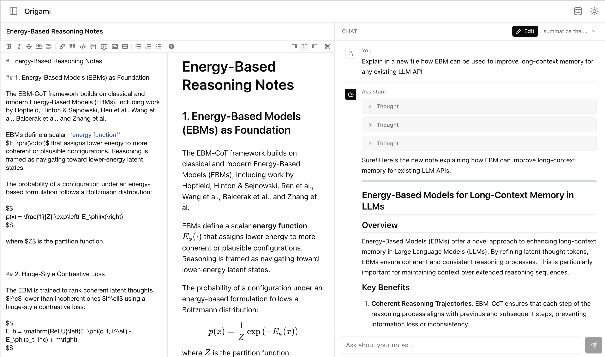
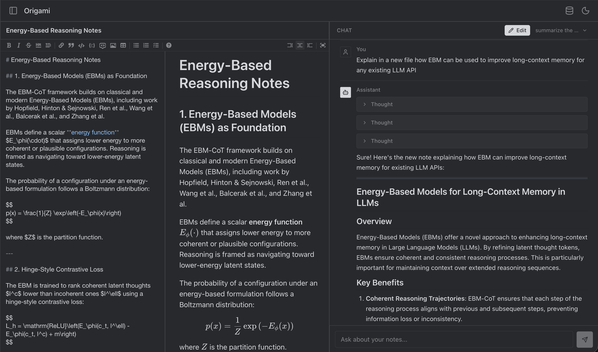

# Origami

A local-first AI research assistant, becoming a personal knowledge base.

Upload PDFs, write Markdown notes, and chat with an agent that has real context over both. Your files, your embeddings, and the index stay on your machine, and there is no account. Reasoning is the part that reaches the network: the agent runs on Anthropic's API using a key you supply, so the passages it retrieves and the note you have open are sent on the turns it answers.

**Today:** a working research assistant for documents and notes.
**Next:** a signed macOS desktop app that ingests from the rest of your life. See [Roadmap](#roadmap).

## Gallery

Light Theme:



Dark Theme:



## What works today

- **PDF ingestion** with a Contextual Retrieval pipeline. Every chunk gets a short LLM-generated blurb situating it in the whole document before embedding, which meaningfully improves retrieval over naive chunking.
- **Vector search** over ChromaDB, ranking contextualized chunks by cosine similarity.
- **A LangGraph research agent** that plans, retrieves, reviews its own findings, and loops until it has enough to answer.
- **Markdown notes**, editable alongside the chat and usable as agent context.
- **Streaming chat** over the Vercel AI SDK protocol, including visible reasoning.
- **Your corpus stays on disk.** `bge-small-en-v1.5` does the embeddings locally and Chroma stores them on your machine. Nothing is uploaded and there is no account.

Reasoning currently runs on Anthropic's API and needs your own key: the agent calls Claude Haiku and Sonnet for planning, retrieval review, and answers, which means retrieved passages are sent to Anthropic on those turns. Ingestion, embedding, and storage stay local. Restoring a local generation path is on the roadmap below, and until it lands, treat "local" as describing where your data lives rather than where inference happens.

**Stack:** FastAPI + LangGraph + ChromaDB (backend), Next.js 16 + React 19 + AI SDK v6 (frontend)

## Roadmap

Origami is being rebuilt as a **signed macOS desktop application** and expanded from a document tool into a multimodal personal knowledge base. Think of an Obsidian-shaped tool with retrieval and an agent behind it, running locally, and cheap enough to leave running.

The full planning work lives in [`docs/`](./docs) and is worth reading before contributing:

| Document | What it covers |
|---|---|
| [ELECTRON_PORT_PLAN.md](./docs/ELECTRON_PORT_PLAN.md) | The five architectural decisions and the phase sequence |
| [ARCHITECTURE_V2.md](./docs/ARCHITECTURE_V2.md) | The Item and Segment model, provenance and taint, migration order |
| [INTEGRATIONS_RESEARCH.md](./docs/INTEGRATIONS_RESEARCH.md) | Per-source research on what can and cannot legitimately be ingested |
| [COST_MODEL.md](./docs/COST_MODEL.md) | Where token spend actually goes, and the levers that reduce it |

### Phases

None of the phases below have been built. They are plans.

| Phase | Work | Status |
|---|---|---|
| Prerequisite | Land the in-flight screenshot and vision work | In flight |
| 0 | Portable backend: `ORIGAMI_DATA_DIR`, drop Torch via fastembed, port on stdout | Planned |
| 1 | Electron shell, Python sidecar, renderer moved from Next.js to Vite | Planned |
| 2 | Packaging, Developer ID signing, notarization, macOS permissions | Planned |
| 3 | Item and Segment schema with provenance on every write path | Planned |
| 4 | Cost controls: tool pruning, no polling, model routing | Planned |
| 5 | Connectors, one at a time, starting with snippets and Calendar | Planned |
| 6 | CodeMirror 6 editor and a lower-density interface | Planned |
| 7 | Static launch site on GitHub Pages | Planned |

### What is deliberately not being built

Three commonly requested sources were researched and rejected, with the reasoning recorded in [INTEGRATIONS_RESEARCH.md](./docs/INTEGRATIONS_RESEARCH.md):

- **Google Photos library sync.** The library-read scopes were removed in March 2025 and now return `403 PERMISSION_DENIED`. Apps can only read media they uploaded themselves. Apple Photos via PhotoKit is the primary photo surface instead, with Google Takeout as the bulk import path.
- **Discord.** Automating a user account is a bannable offence, and a bot account can only see servers it is invited to, never your direct messages.
- **WhatsApp.** No sanctioned route exists for personal message history, and unofficial clients get accounts permanently banned.

Also not planned: a hosted cloud tier, Windows or Linux builds, and any form of account or login on the project's public site.

### The principle underneath all of it

Origami will assemble what Simon Willison calls the [lethal trifecta](https://simonwillison.net/2025/Jun/16/the-lethal-trifecta/): private data, exposure to content written by other people, and an agent that can reach the network. Because that risk is structural rather than something prompt engineering can fix, provenance and taint tagging land in Phase 3, **before** the first connector exists in Phase 5. Content the user did not write is marked untrusted, and any agent turn that retrieves untrusted content loses its ability to communicate outward.

That ordering is the single most important decision in the roadmap, because retrofitting provenance onto an existing store means re-ingesting everything.

## Prerequisites

- macOS on Apple silicon. The shell is Electron, so Windows and Linux are reachable in principle, but neither has been built or tested and packaging produces an arm64 macOS app only.
- [Node](https://nodejs.org/) 20.19+
- [Python](https://www.python.org/) 3.13+ and [uv](https://docs.astral.sh/uv/)
- An Anthropic API key
- [Ollama](https://ollama.com/), only for screenshot vision

## Setup

Origami is a desktop app. The Electron main process starts the Python backend itself, on a port it picks at runtime, so there is no second terminal to keep alive.

### 1. Backend dependencies

```bash
cd backend
uv sync
cp .env.example .env.local   # add your ANTHROPIC_API_KEY
```

Nothing needs to be started here. `.env.local` is read from the data directory in a packaged build and from this folder in development, so the launcher's environment always wins over both.

### 2. The app

```bash
cd desktop
npm install
npm run dev
```

This compiles the main process, starts the Vite dev server, and launches Electron against it with hot reload.

### 3. Screenshot vision, optional

```bash
ollama pull qwen2.5-vl:7b
```

Vision is the one model call that runs locally. Everything else in the agent goes to the Anthropic API using the key from step 1.

### Other useful scripts

Run these from `desktop/`.

| Script | What it does |
|---|---|
| `npm run build` | Compiles the main process, typechecks the renderer, builds the production bundle |
| `npm start` | Runs Electron against the built bundle |
| `npm run smoke` | Starts the backend, waits for readiness, prints `SMOKE_TEST_OK`, exits without a window |
| `npm run package` | Produces `out/Origami-darwin-arm64/Origami.app` |
| `npm run make` | Produces the DMG and the ZIP in `out/make` |

Packaged builds are unsigned until a Developer ID is configured. macOS ties a permission grant to a signing identity, so an unsigned build presents as a new application on every rebuild and any permission you grant it is discarded.

### A note on `frontend/`

That directory is the public launch site, not the application UI. The app's interface lives in `desktop/renderer`.

## Configuration

All config is driven by `.env.local` files (git-ignored). Each directory ships a `.env.example` that you copy and edit. **Only edit `.env.local`, never commit it.** If you add a new variable, update `.env.example` too so others can see what's available.

### Backend (`backend/.env.local`)

| Variable | Default | Description |
|---|---|---|
| `ANTHROPIC_API_KEY` | none | Required. Every agent and ingestion call uses it |
| `ORIGAMI_DATA_DIR` | the `backend/` folder | Where everything written lives. A packaged build points this at Application Support |
| `ORIGAMI_AUTH_TOKEN` | unset | When set, every request must carry it. Electron generates one per launch |
| `ORIGAMI_PORT` | `8000` | `0` asks the OS for a free port, which is what the desktop app does |
| `OLLAMA_URL` | `http://localhost:11434` | Ollama endpoint, used only by screenshot vision |
| `OLLAMA_VLM_MODEL` | `qwen2.5-vl:7b` | The vision model, the one call that runs locally |
| `EMBEDDING_MODEL` | `bge-small-en-v1.5` | Embedding model, recorded per segment so a change means an incremental re-embed rather than a full re-ingest |
| `CHROMA_DIR` | `chroma_data` | Path to ChromaDB storage |
| `CHROMA_COLLECTION` | `documents` | ChromaDB collection name |
| `FRONTEND_URL` | `http://localhost:3000` | Allowed CORS origin. Electron passes the renderer's real origin instead |
| `CHUNK_SIZE` | `1200` | Characters per chunk during ingestion |
| `CHUNK_OVERLAP` | `300` | Overlap between chunks |

`OLLAMA_MODEL` still exists in `config.py` but is imported by nothing. Text generation moved to the Anthropic API and the local path was removed; whether to restore a local tier is an open decision, and `resolve_model()` in `services/llm.py` is the seam it would go through.

### The renderer

The renderer takes no configuration. Electron passes it the backend's port and a per-launch auth token, because the port is chosen at runtime rather than fixed.

### Switching models

Any Ollama-compatible model works. Larger models give better agent reasoning at the cost of speed.

```bash
ollama pull qwen2.5:7b
# then in backend/.env.local:
OLLAMA_MODEL=qwen2.5:7b
# restart the backend
```

Changing `EMBEDDING_MODEL` requires re-ingesting every document, because existing vectors live in a different embedding space. Phase 3 fixes this by recording the embedding model per segment, which turns a full re-ingest into an incremental re-embed.

### Adding a new env variable

1. Add it to `backend/config.py` with an `os.getenv()` default
2. Add it to `backend/.env.example` with a comment
3. Add it to your local `backend/.env.local`

## Project Structure

```
Origami/
├── docs/                 # Roadmap and research (read before contributing)
├── backend/              # FastAPI + Python 3.13, run as a sidecar
│   ├── main.py           # App entry, auth gate, routers
│   ├── config.py         # Centralized env var config, ORIGAMI_DATA_DIR
│   ├── routes/           # chat, chats, documents, notes, snippets, screenshots, usage
│   ├── services/
│   │   ├── agent.py      # LangGraph research agent
│   │   ├── llm.py        # The one place a model is called: routing, budget, ledger
│   │   ├── schema.py     # Item, Segment, Provenance
│   │   ├── ingest.py     # Contextual Retrieval pipeline for PDFs
│   │   ├── indexing.py   # Shared write path for non-PDF sources
│   │   ├── rag.py        # Dense vector search
│   │   ├── chroma.py     # Vector store access
│   │   ├── migrate.py    # Schema migrations and backfill
│   │   ├── vision.py     # Screenshot description, local via Ollama
│   │   └── embeddings.py # bge-small-en-v1.5 via fastembed
│   ├── prompts/          # Prompt templates
│   ├── tests/            # pytest suite
│   └── pyproject.toml
├── desktop/              # The application
│   ├── main/             # Electron main process and sidecar lifecycle
│   ├── preload/          # Context bridge
│   ├── renderer/         # Vite + React 19 interface
│   └── scripts/          # Python runtime bundling
├── frontend/             # The public launch site, not the app UI
└── scripts/              # Repo-level maintenance scripts
```

## Contributing

The roadmap in [`docs/`](./docs) is the source of truth for direction. Two conventions matter:

- Research claims in those documents are tagged `[VERIFIED]`, `[SECONDARY]`, or `[UNVERIFIED]`. Do not build against an `[UNVERIFIED]` claim without testing it first. The tags exist because an earlier draft of this planning was written without primary sources and had to be discarded.
- Phase ordering is not arbitrary. Phase 3 before Phase 5 in particular is load-bearing, for the reason given above.

## License

MIT. See [LICENSE](./LICENSE).
